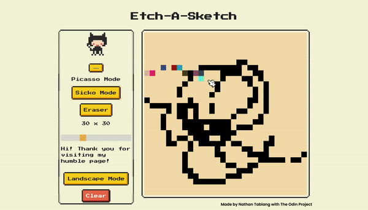

# EtchASketch

Ever felt like reliving your childhood memories? Fret no further! This allows you to draw practically anything you want with color modes ranging from normal mode, sicko mode, or even erasing all of them! If the drawing space isn't enough, try landscape mode too!       

The design is made with NES.css ! I truly could not have done without them!
https://nostalgic-css.github.io/NES.css/#
